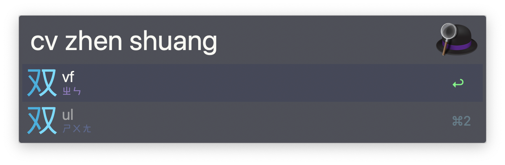

    

# Alfred ShuangPin Convert

This is an alfred workflow build to help memorizing the mapping between pinyin typing sequence and shuangpin sequence.

[中文版README](./README_zh.md)

## Usage

Type the Input query `cv [pinyin_sequence_space_seperated_ot_not]` in alfred to convert to shuangpin, conversion layout can be set by following the [Config](#config) section

## Prerequisite

- Any macOS which has built-in Python 2.7
- Alfred 4+ with Powerpack (v3 should also works, but not tested)

## Installation

- Head over to [Releases](https://github.com/tomy0000000/Alfred-ShuangPin-Convert/releases), download the latest version
- Double-click on `Shuangpin Convert.alfredworkflow` to install
- Auto-Update of workflow is enabled by default, but can be toggle by sending query
  - `cv workflow:autoupdate` for enabling Auto-Update
  - `cv workflow:noautoupdate` for disabling Auto-Update

## Config

* Config can be set in [workflow environment variables sheet](https://www.alfredapp.com/help/workflows/advanced/variables/#environment), by pressing `[x]` icon in Alfred Preferences

| Name               | Description                               | Default  |
| ------------------ | ----------------------------------------- | -------- |
| `MAIN_LAYOUT`      | Layout to convert shown in title          | `xiaohe` |
| `SECONDARY_LAYOUT` | Layout to convert shown in secondary text | `zhuyin` |

Currently supported layout includes:

* 小鶴雙拼 (xiaohe)
* 微軟雙拼 (microsoft)
* 拼音加加 (plusplus)
* 搜狗雙拼 (sougou)
* 注音符號 (zhuyin)